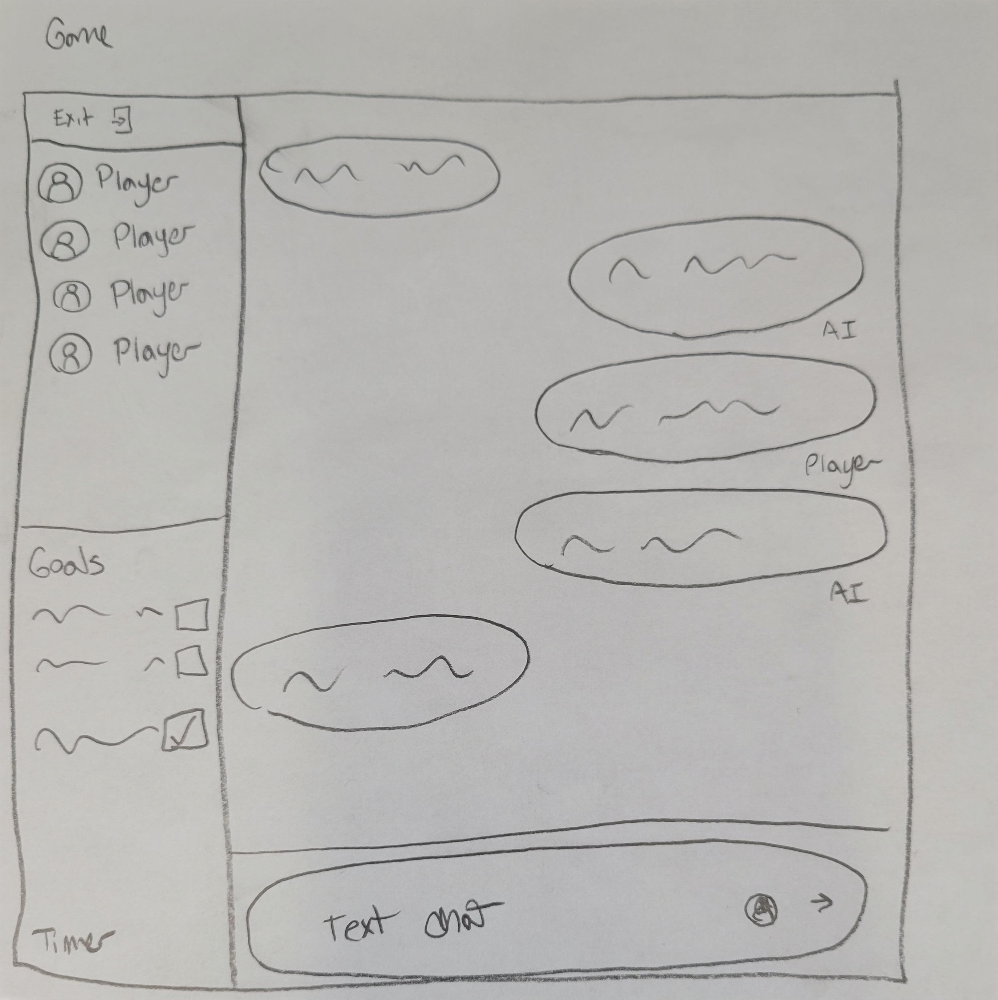

# Guardians of Gaia

## Problem Statement

### Target Learning Audience
The target learning audience for Guardians of Gaia is **middle and high school science students**.

### Identified Learning Need
Science instruction and simulations can often feel boring to many students as they can lack **engagement** and student **collaboration**. From my personal experiences, science labs and simulations can often feel as though they lack true discovery, limiting student motivation, engagement, and memory. As such, it is necessary to explore ways to increase engagement and collaboration in students, as well as a sense of discovery. Guardians of Gaia aims to combine these needs through a Tabletop Roleplaying Game (TTRPG) approach, using Dungeons and Dragons-based mechanics run by a multi-agent AI framework. This approach has been utilized in many disciplines such as history (e.g. Petousi, et al., 2025) and English (e.g. Ortolani and Ortolani, 2021), however I have yet to find examples of this approach being adapted at scale. This is most likely due to the nature of these types of games: they require a lot of work to maintain, create, and develop, most of which would fall to the teacher. As such, AI has an opportunity to fill the gap needed to alleviate this learning need.

### Rationale for AI Use
AI here will help with making the content engaging for students, as well as facilitating collaboration between students. Here AI will serve as a facilitator of the learning content as opposed to a creator of information. It should be noted here as well that to my knowledge there have yet to be platforms designed for learning where AI acts as the game master; there are platforms that can do this, however, they are not tailored towards education so there is an opportunity to create a platform for this need.

## Needfinding

### Context Description
The context examined was a large middle school science classroom with approximately 30 students and one teacher. Students are currently taking part in a unit about ecosystems. Students in this unit are expected to learn about ecosystem dynamics (e.g. population, food, biodiversity); the teacher is following New York State’s P-12 Learning Standards (https://www.nysed.gov/sites/default/files/programs/standards-instruction/ms-science-learning-standards.pdf) for the following learning goals:
- MS-LS2-2. Construct an explanation that predicts patterns of interactions among organisms in a variety of ecosystems.
- MS-LS2-5. Evaluate competing design solutions for maintaining biodiversity and protecting ecosystem stability.

The teacher has run this unit before, however struggled to maintain student interest in the subject, especially when it comes to running ecosystem simulations. In these simulations, students often work together in groups to explore how population changes in an ecosystem occur. These simulations are often done fairly quickly (~20 minutes) and are done on a computer. Students have an accompanying worksheet to complete with the simulation.

### Needfinding Method
To assess the problem an artifact analysis was conducted with simulations aimed at teaching ecosystem related concepts. A total of three resources were assessed:
- OpenSciEd 7.5 Ecosystem Dynamics (https://openscied.org/instructional-materials/7-5-ecosystem-dynamics/) 
- LS2. Ecosystems Lab (https://www.funsciencetools.org/middle-school-science/ls2-ecosystems)
- Forest Ecosystem (https://gizmos.explorelearning.com/find-gizmos/launch-gizmo?resourceId=639)

These resources were analyzed for the following criteria:
- Opportunity for collaboration
- Engagement
- Visuals
- Science Content (e.g. what aspects of science are used?)

### Key Findings
1. **Little to no collaboration**: While these resources can be used collaboratively, there is nothing about these resources that deliberately support collaboration. If these resources are to be used collaboratively, work is needed to be done by the teacher to adapt these materials for student collaboration. Additionally, if done collaboratively, these resources can create conditions for “free riders” where one or two students are doing the work.
1. **Not very engaging**: By themselves these simulations are pretty boring; engagement can be increased with an accompanying worksheet or storyline, such as in the case of OpenSciEd’s Orangutan themed case study and worksheet, but by themselves they are very unengaging. The visuals are pretty uninteresting and (at least to me) there is little reason for students to care. 
1. **Replicates scientific practices**: All three of the artifacts try to replicate scientific practices, such as graphing, changing variables, and running experiments. These are built into the simulations, and show the importance of the scientific method in these types of lessons.
1. **Guided**: These simulations are very heavily guided or it is assumed that there is a specific goal attached to these simulations. This means that there is no opportunity for exploration or experimentation.
1. **Simple**: All three simulations are very simple with limited interaction. Typically, there are one to four variables that the students can control. This is not necessarily a bad thing, but limits exploration and experimentation.

### Revised Need Statement
While the original need statement still holds true, there is a need for refinement as there are more nuanced reasons for the issues. 

Science simulations are often unengaging in science; they are simple, guided, lack discovery, and lack collaboration.

## Literature Review

### Sources Reviewed
A total of four papers were reviewed, sourced from Consensus. The first paper (Smetana & Bell, 2012) is a literature focused on the effectiveness of computer simulations for science education. While an older paper, the findings highlight how the effectiveness of simulations in science education is dependent on the context in which they are used and the design of the simulation. More specifically Smetana and Bell (2012) argue that computer simulations are most effective when they supplement instruction, include support systems (e.g. animations, background information), and promote conceptual change (e.g. cognitive dissonance). This relates to my project by providing design directions for creating an effective AI-enhanced simulation. 

The second paper reviewed for this project was on using LLMs for the rapid development of physics simulations (Ben-Zion, et al., 2025). Here the authors present an approach for leveraging Claude to quickly create physics simulations and tested the effectiveness of the created simulations. This paper was selected because it presents an alternative AI solution to the one proposed for this project; it is effective however they still may exhibit the same limitations as existing science simulations. Here AI is not challenging the existing simulation space, just making the creation of simulations easier and more accessible.

The third paper reviewed presented a role-playing simulation game for increasing engagement in science-policy (van Beek, et al., 2022). The authors found that by making the situation more “real,” through role-playing games, there was higher engagement with the presented content. This is important as it can provide evidence for the role-play approach that I plan on employing for the project; role-playing games can assist with making students care about the material they are being presented with. It should be noted though that this paper focuses primarily on science-policy (e.g. climate change) rather than science instruction, so the applicability of this study to Guardians of Gaia may be limited. 

The final paper reviewed for this project reported findings for an experiment where students interacted with an LLM assisted science game (Chen & Chang, 2024). The study found that students who had access to the LLM while playing the game had lower cognitive load, higher intrinsic motivation, and higher performance than those without the AI tool. This is important to consider because it shows how LLMs when partnered with role playing games can enhance game-based learning in science education.

### Key Ideas from Literature
Across the different sources a total of three key themes emerged that are relevant to Guardians of Gaia. The first theme that emerged was the importance of instruction. Science simulations should be a supplement to instruction, not a replacement (Smetana & Bell, 2012). This was a noted limitation in Ben-Zion, et al. 's, approach (2025), as by themselves the generated simulations are fairly limited and lack embedded pedagogical content knowledge (p. 424).

The second theme that emerged was the need for support systems and scaffolding. Similar to the first theme, simulations are enhanced when there exists appropriate scaffolding (Smetana & Bell, 2012); simulations should be enhanced by including background information or context, conceptual development guidance (Ben-Zion, et al., 2025), feedback (Chen & Chang, 2024), etc. 

The final theme that emerged was role-playing as a way to increase engagement. As noted by Ben-Zion, et al., (2025), a limitation of their developed simulations is that they lack structured student engagement. Role-playing elements may provide a solution to that, as found with van Beek, et al., (2022), as using role-playing elements in their climate change simulation made the problems feel more real and in turn increased learner engagement with the material.

### Existing Solutions and Their Limitations
The main gap that was identified with the reviewed literature is that the use of AI in science simulations is rather limited. For one, searching for literature and tools in this space was rather difficult as there are not a lot of existing resources available; I believe this may have to do with the rather new nature of the topic. Additionally, the use of AI that I was able to find either had to do with the creation of simulations (e.g. Ben-Zion, et al., 2025) or were used as a supplement to existing science simulations (e.g. Chen & Chang, 2024). There were no resources that I identified that truly leveraged the transformational nature of AI and utilized its capabilities for supporting effective simulation design.

Another gap that I identified is the lack of teacher support. As noted by Smetana & Bell (2012), teacher preparedness is a common gap in science simulation literature; teachers have a huge impact on the effectiveness of simulations, so care must be taken to support their use and understanding of created tools. While, some implied care is taken by Ben-Zion, et al., (2025) as their work is about the creation of science simulations, the same care is not taken by the other studies, as teachers and classroom implementation are not discussed. 

### Implications for Project
Two design implications have been identified from the literature. The first is the need for support materials; to better scaffold and support this project, I believe that there will be a need to develop materials to structure and scaffold the system. An initial idea I have that may meet this is to create and provide an accompanying worksheet that the learners will need to complete while using the system. 

The second implication that has been identified is the need for teacher support. Ideally, the system should provide a lot of teacher control, but should not be difficult to use in a classroom. 

## Design Feature List
### Needs
- The four agents (feed forward)
    - Rules Lawyer: Maintains consistency with game rules; fact check player actions
        - Tools: Dice roller, game rules bible, character sheets, time check
    - Storyteller: Creates the story
        - Tools: Character creator, object creator
    - Expert: Expert over subject; responsible for fact checking and ensuring that the story has the educational content
        - Tools: Access to worksheet and/or teacher notes; wikipedia
    - Historian: Maintains the story bible; rewrite story to fit within the story bible
        - Tools: Story bible
- Critical functions (tools)
    - Dice Roller: Roll a dice (random number generator)
        - Args: Max number
    - Game rules bible: Access the game rules bible (cannot be written to by agents)
    - Character sheets: Access player information (history, action, items): can be written by agents
    - Time check: access current time to make sure game stays within a certain time limit; if it gets close start trying wrap up the story and worksheet (for prototype max time is 10 minutes, but can be overwritten in teacher settings)
    - Character creator: Create or access an NPC history
        - Args: traits, appearance, secrets
    - Object creator: Create or access object information
        - Args: appearance, history, interactions
    - Worksheet access: Access (not write) worksheet and/or teacher notes for reference
    - Wikipedia: use only to access information if additional information is needed
    - Story Bible: Write and read to the story bible; add character interactions and history of agent returns
    - Teacher settings: teachers can upload worksheet to be completed with simulation, set learning goals, time limit, and can modify the story (originally set by AI) if needed
- Voice and chat features
    - Multiplayer chat (think discord)
    - Log and direct chat

### Wants
- Character customization
- More in depth rules for the game
- Framework for teacher use
- Long term history for multi-session use

### Blue Sky
- Computer vision for map tracking
- Generative visuals for characters, items, objects, etc.

## Low-Fi Prototype
### Start Page

### Teacher Settings

### Game Page

## High-Fi Prototype
<a href="https://github.com/jcsansom-cyber/Guardians-of-Gaia-main">Link to Repository</a>
To run please first run a ollama server in the terminal (instructions for commands are on the teacher settings page) and write the name of the model you are using in the Model Name text area. This works best with llama3.2

## Evaluation
### Purpose of evaluation:
The purpose of this evaluation is to answer three questions:
- Can students use the tool to effectively answer a worksheet?
- Do students enjoy using the tool (compared to a traditional science simulation)?
- Is the AI able to appropriately combine the pedagogy and fun?

By answering these questions, I should be able to appropriately understand how well the approach to science simulations works in a text-based roleplaying environment.

### Evaluation Plan:
I intended to test my application by having 2 graduate students collaboratively complete a task with the application. This population was selected because of convenience and are not representative of my intended audience, so it is a limitation of this evaluation. To assess the three proposed research questions, I followed the following plan:
1. Learners were provided with a sample worksheet (see appendix), generated by Gemmni since the content is pretty simple but it was hard to find an exisiting worksheet that was general enough (e.g. not attached to other learning materials) to be easily used in the tool as well as fast for the learners to fill out, and asked to fill it out to the best of their ability.
1. Learners were provided access to the system and were asked to use the system to answer the worksheet
1. Learners will be asked to think aloud while using the application
1. When done or time is up, learners will take another look at their worksheet and change any answers they want to. Then I will ask the learners about their thoughts regarding the tool (e.g. how did they feel interacting with it, did the interaction feel natural etc.); I am not coming in with pre-eixisting interview questions, but these will come about naturally through the think aloud.

From this plan I anticipate that I will collect the following pieces of data:
- Observations from user interaction
- Think aloud comments
- Follow up interview question responses
- Worksheet answers
- Response Log between the users and AI

### Criteria for Judgement
I will be using the changes in the results from the worksheet to judge how successful the tool is at combining the content and the roleplaying aspect. If students are able to improve in accuracy from the baseline, then I believe that there is some proof that the tool is effective. While I do not have a control group for this (e.g. students who use a traditional simulation), I think that pre and post-tests will be and effective way to determine success.

Additionally, since some of what I am interested in is the user experience, I will make judgements if the AI system is “good” by determining how much engagement the learners have while using the tool. Since I will be observing the learners while they are using the tool I should be able to gauge engagement (e.g. are the learners focused on the tool or are they talking about other things). While this is more of a subjective assessment, it is important to guage since a large part of the motivation for this project is engagement. I will also ask follow up questions to gather general feedback and comments regarding usability.

Finally, I will look at the logs between the learners and the AI output to judge how well the AI was able to combine the educational content and the roleplay. Again this will be mostly subjective, but since I have access to the worksheets and the answer key, I should be able to gauge how efficient the AI was at combining these. 

### Results
Overall I think that the tool was successful at completing the task in a fun way. For the worksheets, the pre-task average was 23.3% accuracy while the post was a 40% accuracy, clearly showing that the learners learned from the tool. Learners also seemed very engaged while using the tool (no off topic conversations) and were able to successfully use the tool collaboratively (e.g. learners would swap between reading, typing, and decision making unprompted).

In terms of usability, while the tool did have minor bugs and usability issues (e.g. text-to-speech did not work, hard to read text, etc.), overall the users did not experience any difficulties in using the tool. Learners instantly understood where to go and how to interact with the system. There was one difficulty on the start screen where the users did not know how to start the chat and I had to point out the user switch feature, but both of these issues can be resolved with a text color change and font size increase since they just blended too much into the background to be noticeable. 

As for the content that the tool generated, it was rather mixed. During the follow up interview, the learners expressed that they felt that the story was very fun and interesting, and made learning the content really enjoyable. However, they did express three major issues, the first being there was too much text. Since there is a timer for the tool (learners were provided 15 minutes) they felt as though they were spending more time reading then discussing the content or making decisions. The logs I collected also seem to confirm this as during the 15 minutes the learners only responded 7 times, which frankly is not a lot. The second issue is that the timer is a little too stressful. While watching the learners use the system once the timer got to the 5 minute mark the learners verbally and visually began to rush; reading speed increased and there was less discussion than previously. From my observations as well (and from reading the logs) the AI did not do a good job at creating an “end” which the learners remarked upon as well. I am aware that this is a common issue with LLMs in general since they are often designed for engagement, but it left the learners feeling unsatisfied. The last issue that the learners remarked upon is that there sometimes the AI would make mistakes. For instance it kept referring to one of the users using the wrong pronouns (this issue though is partly on me since I never ask for pronouns), or would try to roll a 0 sided dice, which the learners were confused by.

Finally after examining the chat log, I am not convinced that the agents are prompted well enough to put enough educational content into the story. While the learners did improve in their overall scores, the learners did express that they felt that when compared to a traditional science simulator, the content was harder to understand (which I agree with). Content is often spoon-feed (e.g. “Sanji explains, 'You see, in a food chain, water is crucial for many organisms. Plants use sunlight to create energy, and then animals consume those plants or other animals to get their energy.') to the user, which is appropriate for the user age group, but often repeats  content (may not be bad) or puts it in a way that it is not clear what the educational content is. It is very clear on my part that the agents need to have more guard rails or there may need to be a template for teachers to use.

### Reflection and Implications
Overall, I think that the tool is able to successfully do what I set out to do. It is not perfect, but the learners did express enjoyment while using the tool and seemed very engaged, which were my main goals with the prototype. I think that the overall strengths of the prototype is that it is fun and engaging; the learners who used the tool were very clearly enjoying the experience, laughing, debating, and discussing. Improvements are needed, such as improved prompting, making the timer less stressful, and making the text output shorter. However, I think the prototype best serves as a proof of concept that this type of learning can be effective as it still needs work, but it achieves its overarching goals of making science simulation content engaging, collaborative, and fun. I feel pretty confident of this at least, since as a proof of concept it seems to work.
As for key improvements that are needed, beyond minor aestitic and bug fixes, something needs to be about the LLM prompting. Since it would make mistakes and be very verbose, I need to take a look at the prompting again and determine what additional guard rails are needed. This may also be a limitation of the model I was using (llama3.2); while I did experiment with different models, llama3.2 gave the most coherent output, while also being fairly quick. Other models may be much better at doing this, such as deepseek or gemma, but it would require a major overhaul of the prompts to ensure that the output is generated in a reasonable time (even with the smaller models). Additionally, there is a need to make the timer less stressful. I don’t think I should get rid of it as it reigns in the AI by forcing it to create the story within a certain time frame and gives the teacher more control over the tools, there does need to be some way to make it less stressful. An idea I have is to make the timer just accessible to the AI, and less strict, so that the learner has some idea of how long the simulation should take, but it is not directly visible, but I am still working on this.

Now, I do think my evaluation does have limitations, such as small sample and the sample not being directly representative of the target learners. I relied on convenience sampling mostly due to time constraints, and this is a major limitation of the results, and while I still believe that overall my goals were achieved, I don’t necessarily know how well these results would be on a larger scale. Additionally, most of the judgements of the AI tool were subjective, which limits the results. Finally, the worksheet that was used had some limitations; since it was generated by Gemini and myself how has pre-existing knowledge on the topic, some of the questions ended up being confusing for the learners to answer, even with the tool. If I were to continue running evaluations, I would need to expand my sample and change some of my evaluation methods.

## Works Cited
Ben-Zion, Y., Zarzecki, R. E., Glazer, J., & Finkelstein, N. D. (2025). Leveraging AI for rapid generation of physics simulations in education: Building your own virtual lab. The Physics Teacher, 63(6), 424-427.

Chen, C. H., & Chang, C. L. (2024). Effectiveness of AI-assisted game-based learning on science learning outcomes, intrinsic motivation, cognitive load, and learning behavior. Education and Information Technologies, 29(14), 18621-18642.

Ortolani, K., & Ortolani, A. (2021). GAMES-BASED LEARNING: AN EXPERIENCE REPORT IN TEACHING ENGLISH DURING THE PANDEMIC. Matraga - Revista do Programa de Pós-Graduação em Letras da UERJ, 28.

Petousi, D., Katifori, A., Sakellariadis, P., Servi, K., Kougioumtzian, L., Koutiva, G., Roussou, M., & Ioannidis, Y. (2025). The Intersection of Play and History: Integrating Historical Content in Tabletop Role-Playing Games for Education. Proceedings of the 20th International Conference on the Foundations of Digital Games. https://doi.org/10.1145/3723498.3723811.

Smetana, L. K., & Bell, R. L. (2012). Computer simulations to support science instruction and learning: A critical review of the literature. International Journal of Science Education, 34(9), 1337-1370.

van Beek, L., Milkoreit, M., Prokopy, L., Reed, J. B., Vervoort, J., Wardekker, A., & Weiner, R. (2022). The effects of serious gaming on risk perceptions of climate tipping points. Climatic Change, 170(3), 31.

## Appendix
### Worksheet and Answer Key (Both Gemini Generated)
Part 1: Vocabulary Match-Up
Before starting the simulation, make sure you know your roles! Draw a line to match the term to its definition.
Term | Definition
Producer | An organism that gets energy by eating other organisms.
Consumer | An organism that breaks down dead material and returns nutrients to the soil.
Decomposer | An organism (usually a plant) that makes its own food using sunlight.
Apex Predator | An animal that hunts other animals for food.
Prey | An animal at the top of the food chain with no natural predators.
Predator | An animal that is hunted and eaten by another animal.

Part 2: Simulation Observations
1. Identify your food chain:
Based on the simulation, record one specific path of energy flow:
(Producer) -> (Primary Consumer) -> (Secondary Consumer) -> (Tertiary Consumer)
2. The Energy Rule:
In a food chain, arrows represent the flow of energy. If a rabbit eats grass, which way does the arrow point? Why?
Direction: ___________________________________________________________
Reason: _____________________________________________________________

Part 3: Critical Thinking & Data
3. Population Shift:
During the simulation, what happened to the Producer population if the Primary Consumer population increased rapidly? Explain the "why" behind the data.
____________________________________________________________________________
____________________________________________________________________________
4. The "What If" Scenario:
If a disease wiped out the Secondary Consumers in your simulation, predict what would happen to:
The Primary Consumers: ______________________________________________
The Producers: ______________________________________________________

Part 4: The 10% Rule (Bonus Challenge)
In biology, only about 10% of the energy at one level of a food chain is passed on to the next. If your Producers start with 10,000 units of energy, calculate how much reaches the following:
Primary Consumer: ____________ units
Secondary Consumer: ____________ units
Tertiary Consumer: ____________ units

Answer Key: Who Eats Whom?
Part 1: Vocabulary Match-Up
Producer: An organism (usually a plant) that makes its own food using sunlight.
Consumer: An organism that gets energy by eating other organisms.
Decomposer: An organism that breaks down dead material and returns nutrients to the soil.
Apex Predator: An animal at the top of the food chain with no natural predators.
Prey: An animal that is hunted and eaten by another animal.
Predator: An animal that hunts other animals for food.
Part 2: Simulation Observations
1. Identify your food chain:
(Answers will vary based on specific simulation, but should follow this logic:)
Grass -> Grasshopper -> Frog -> Hawk
2. The Energy Rule:
Direction: The arrow points away from the grass and toward the rabbit (Grass -> Rabbit).
Reason: The arrow represents the flow of energy. The energy is moving from the plant into the body of the consumer that eats it.

Part 3: Critical Thinking & Data
3. Population Shift:
Observation: The Producer population will decrease.
Explanation: As the number of Primary Consumers (herbivores) grows, there is more "predation" on the plants. The consumers eat the plants faster than the plants can reproduce or grow, leading to a dip in the producer population.
4. The "What If" Scenario:
The Primary Consumers: Their population would increase rapidly because their natural predators (the Secondary Consumers) are gone.
The Producers: Their population would decrease significantly because the exploding population of Primary Consumers would overgraze the area.

Part 4: The 10% Rule (Bonus Challenge)
Calculating energy transfer (10,000 * 0.10):
Producer: 10,000 units
Primary Consumer: 1,000 units
Secondary Consumer: 100 units
Tertiary Consumer: 10 units
Note to Teachers: This illustrates why food chains are rarely longer than 4 or 5 steps; there simply isn't enough energy left at the top to support a large population of apex predators!

### Chat Log
<a href="https://docs.google.com/document/d/1AJDbSP8WsZEN-Bny_xzXSXCGGrgxL2heLDwGueKBB38/edit?usp=sharing"> Chat Log </a>

Guardians of Gaia is created by Jaycee Sansom

[Just the Docs]: https://just-the-docs.github.io/just-the-docs/
[GitHub Pages]: https://docs.github.com/en/pages
[README]: https://github.com/just-the-docs/just-the-docs-template/blob/main/README.md
[Jekyll]: https://jekyllrb.com
[GitHub Pages / Actions workflow]: https://github.blog/changelog/2022-07-27-github-pages-custom-github-actions-workflows-beta/
[use this template]: https://github.com/just-the-docs/just-the-docs-template/generate
